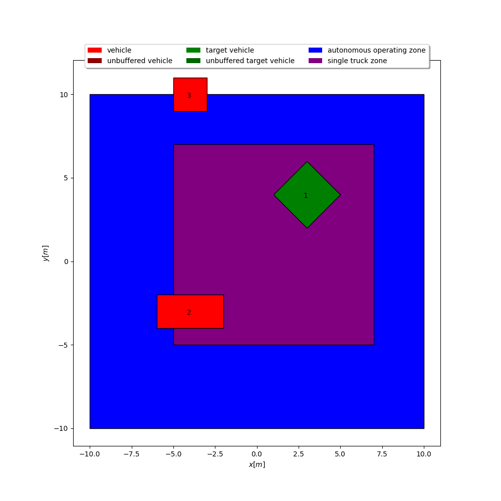
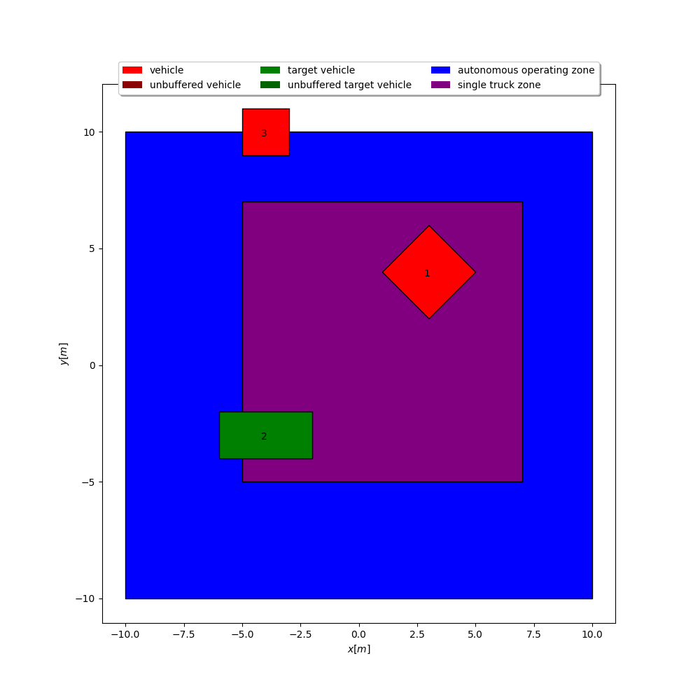
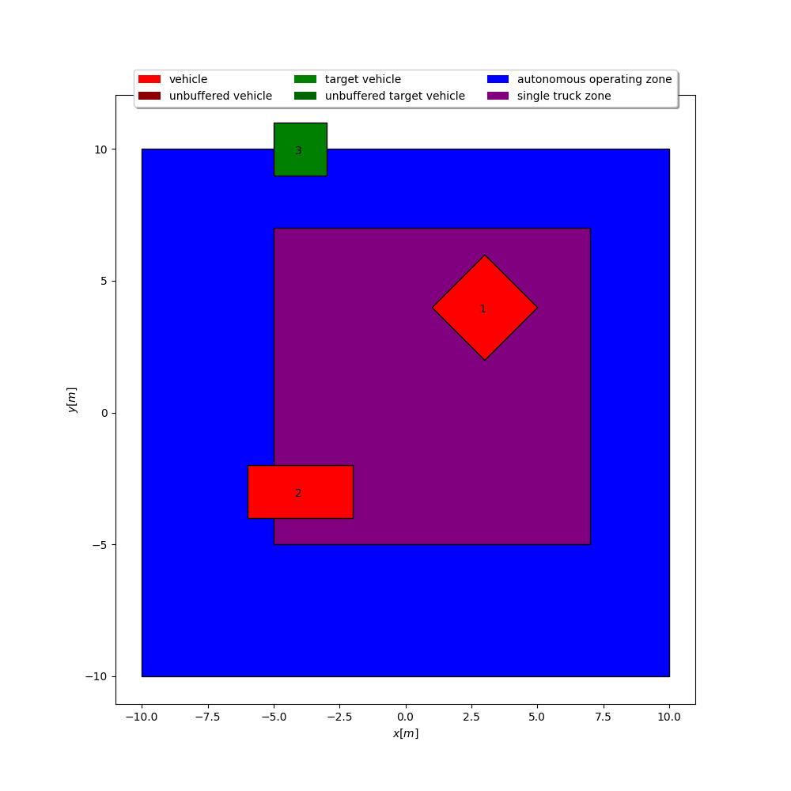
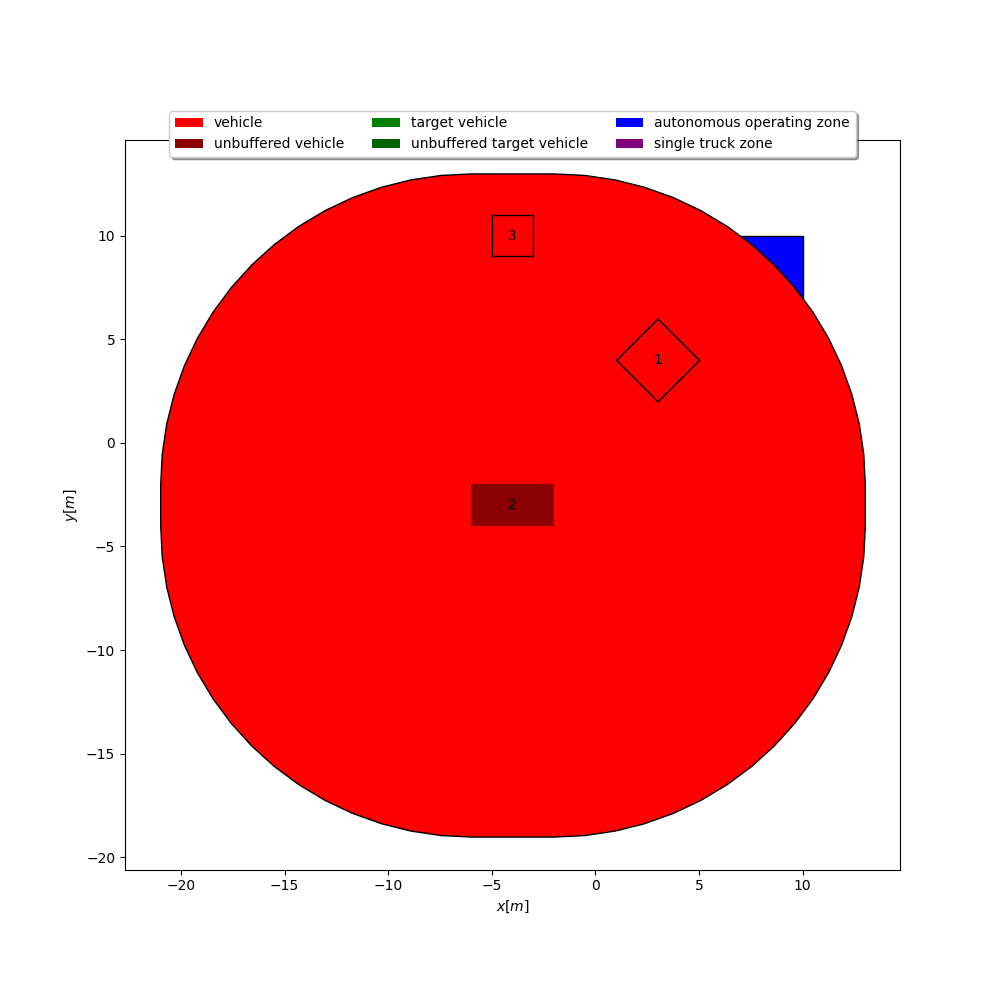

# Pronto.ai Coding Take-Home
This is my submission for the Pronto.ai coding take-home assessment. The intersection checks and buffering of bounds are handeled by the Shapely library. While writing one file to handle all of the tasks is the quickest approach, I chose to organize code as follows:

```bash
zone_occupancy/
├── data/
│   └── zone.json
├── src/
│   ├── main.py
│   ├── utils/
│   │   ├── parser.py
│   │   └── plotter.py
│   ├── vehicles/
│   │   └── vehicle.py
│   └── zones/
│       └── zone.py
└── tests/
    ├── utils/
    │   └── test_parser.py
    ├── vehicles/
    │   └── test_vehicle.py
    └── zones/
        └── test_zone.py
```

This gives the code greater scalability and organizaiton. For example, if one wants to create a new type of vehicle object which inherits ```Vehicle```, a new file can be placed directly inside of ```src/vehicles```. The following files are used to organize and solve the tasks:

- ```vehicle.py``` holds the ```Vehicle``` class which contains vehicle bounding information as well as basic intersection checks.
- ```zone.py``` holds the ```Zone``` class which contains simple zone information such as its bounds and type.
- ```parser.py``` contains a useful utility for parsing a ```.geojson``` file and returning a list of ```Zone``` objects.
- ```plotter.py``` contains a plotter specific this project, allowing for easy visualizaiton.
- ```utils.py``` contains more complex intersection checks.
- ```main.py``` contains the script used to put everything together. Note that it is hardcoded for the particular ```zone.json``` given.

## Assumptions and Considerations
- Assumed that "contained" implies the bounding box of a vehicle is completely within the bounding box of a zone in question.
- Assumed that "occupied" implies an intersection, not containment.
- Assumed that "buffering" happens radially at corners. This is handeled by Shapely.
- Assumed that user-provided data (both zones and vehicles) is valid.
- Assumed that intricate type and exception handeling was unncessary. In a real setting, passing a ```Vehicle``` into a function asking for ```List[Vehicle]``` should be handeled with greater care.


## Setup and Installation
### Prerequisites
- Python 3.8+
- pip

### Installation Steps
1) Clone the repository:
    ```bash
    git clone https://github.com/AlexKoldy/zone_occupancy.git
    cd zone_occupancy
    ```
2) Create and activate a virtual environment (replace ```python``` with ```python3``` depending on your installation):
    ```bash
    python -m venv venv
    ```
    To activate on Linux use:
    ```bash
    source venv/bin/activate
    ```
    To activate on Windows use:
    ```bash
    venv/Scripts/activate
    ```

3) Install the required dependencies:
    ```bash
    pip install -r requirements.txt
    ```

### Running the project
#### Running the main script
To run the main script, use the following command (replace ```python``` with ```python3``` depending on your installation):
```bash
python -m src.main
```

#### Running unit tests
The project is equiped with basic unit tests. They do not directly address the task at hand, but are used to verify basic functionality. To run them, use the following command:
```bash
pytest
```

### Testing and Compatibility
To ensure installation across multiple platforms, this project has been tested on the following:

#### Windows
- **Python Version**: 3.8.10
- **Operating System** Windows 10

#### Linux
- **Python Version**: 3.8.10
- **Operating System** Ubuntu 20.04.6 LTS


## Answers
### Question 1
For each vehicle, submit answers to the following:
1. Is the vehicle contained in the autonomous operating zone?
2. Is any part of the vehicle intersecting the single truck zone?
3. Is any part of the vehicle intersecting the single truck zone that is already occupied by another vehicle?
#### Vehicle 1


##### 1) Is the vehicle contained in the autonomous operating zone?
Yes.
##### 2) Is any part of the vehicle intersecting the single truck zone?
Yes.
##### 3) Is any part of the vehicle intersecting the single truck zone that is already occupied by another vehicle?
Yes.

#### Vehicle 2


##### 1) Is the vehicle contained in the autonomous operating zone?
Yes.
##### 2) Is any part of the vehicle intersecting the single truck zone?
Yes.
##### 3) Is any part of the vehicle intersecting the single truck zone that is already occupied by another vehicle?
Yes.

#### Vehicle 3


##### 1) Is the vehicle contained in the autonomous operating zone?
No, the vehicle intersects the zone, but it is not contained.
##### 2) Is any part of the vehicle intersecting the single truck zone?
No.
#### 3) Is any part of the vehicle intersecting the single truck zone that is already occupied by another vehicle?
No.

### Question 2


#### In the event of a comms loss, the vehicle bounds are buffered out in every direction from its last known position at a rate of 3 m/s. If vehicle 2 has been missing for 5 seconds, are any vehicle buffers intersecting?
Yes.

### Script outputs
The raw outputs of ```main.py``` are pasted below:

```bash
######################### QUESTION 1 #########################
For each vehicle, submit answers to the following:
------------------------Vehicle 1------------------------
(1) Is the vehicle contained in the autonomous operating zone?
Yes.
(2) Is any part of the vehicle intersecting the single truck zone?
Yes.
(3) Is any part of the vehicle intersecting the single truck zone that is already occupied by another vehicle?
Yes.
------------------------Vehicle 2------------------------
(1) Is the vehicle contained in the autonomous operating zone?
Yes.
(2) Is any part of the vehicle intersecting the single truck zone?
Yes.
(3) Is any part of the vehicle intersecting the single truck zone that is already occupied by another vehicle?
Yes.
------------------------Vehicle 3------------------------
(1) Is the vehicle contained in the autonomous operating zone?
No.
(2) Is any part of the vehicle intersecting the single truck zone?
No.
(3) Is any part of the vehicle intersecting the single truck zone that is already occupied by another vehicle?
No.
######################### QUESTION 2 #########################
In the event of a comms loss, the vehicle bounds are buffered out in every direction from its last known position at a rate of 3 m/s. If vehicle 2 has been missing for 5 seconds, are any vehicle buffers intersecting?
Yes.

```


